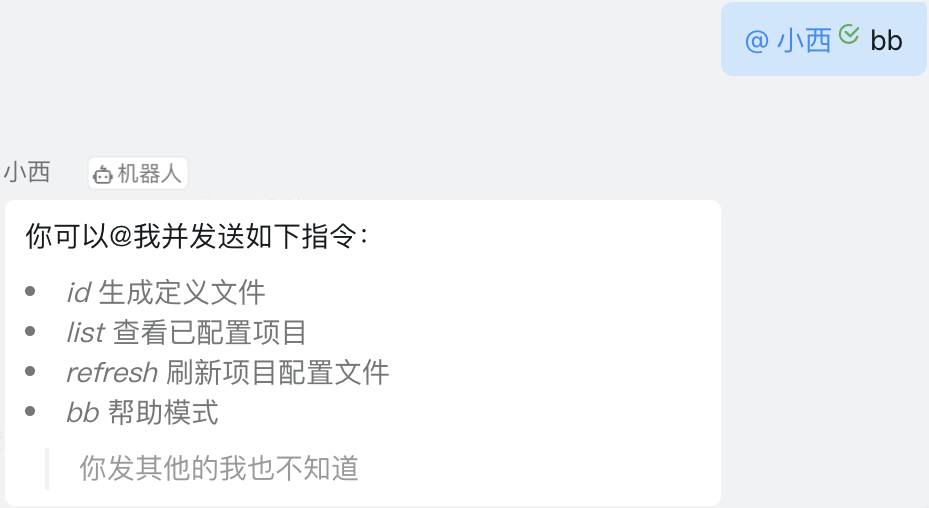
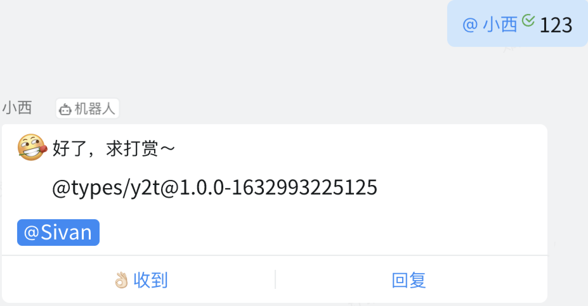

# Y2T-ROBOT

Use Y2T service by DingTalk robot
 
将[Y2T](https://github.com/ShiverZheng/Y2T)服务接入[DingTalk Robot](https://developers.dingtalk.com/document/robots/custom-robot-access)，提升了使用体验。


## 用法

### 项目配置
在[config.json](./config.json)配置好所需的内容，这边将YApi项目的配置文件通过`CryptoJS.AES.encrypt(<TOKEN>, <SECRET>)`进行加密后存储在配置中心。

``` ts
// YApi项目的配置
interface ProjectConfig {
    pid: string
    desc: string
    token: string
    name: string
}

type ProjectConfigs = ProjectConfig[]
```

``` json
// config.json中需要配置的内容
{
    "username": "<YOUR_GIT_USERNAME>",
    "password": "<YOUR_GIT_PASSWORD>",
    "email": "<YOUR_GIT_EMAIL>",
    "registry": "<YOUR_GIT_REPOSITORY_REGISTRY>",
    "protocol": "<YOUR_YAPI_SERVICE_PROTOCOL>",
    "hostname": "<YOUR_YAPI_SERVICE_HOSTNAME>",
    "projectUrl": "<YOUR_PROJECT_URL_IN_YAPI_SERVICE>",
    "accessToken": "<YOUR_DING_DING_ACCESS_TOKEN>",
    "appSecret": "<YOUR_DING_DING_APP_SECRET>",
    "projectsConfigsUrl": "<THE_URL_WHERE_YOU_STORE_THE_YAPI_PROJECT_CONFIGURATION>",
    "secret": "<YOUR_PROJECT_TOKEN_ENCRYPTED_KEY>"
}
```

### 机器人`小西` 用法

- *@小西 list* 查询已配置的项目
- *@小西`<Project ID>`*
- 等待服务返回npm包名，`npm i <response> --save-dev`
- 直接在项目中`import`使用

> *@小西bb* 帮助模式




### 钉钉机器人开发

#### 工具：
钉钉机器人需要通过公网访问应用，开发阶段可以使用钉钉提供的[内网穿透](https://developers.dingtalk.com/document/resourcedownload/http-intranet-penetration)。

#### 安全：

  由于服务架设到公网，所以需要考虑安全问题，这里对所有进来请求都会进行签名校验，只允许来自钉钉机器人的请求，可以参考文档[机器人安全设置](https://developers.dingtalk.com/document/robots/customize-robot-security-settings)，`JavaScript`版本签名校验实现在[utils](./src/utils.ts)中的`verifySign`方法。
